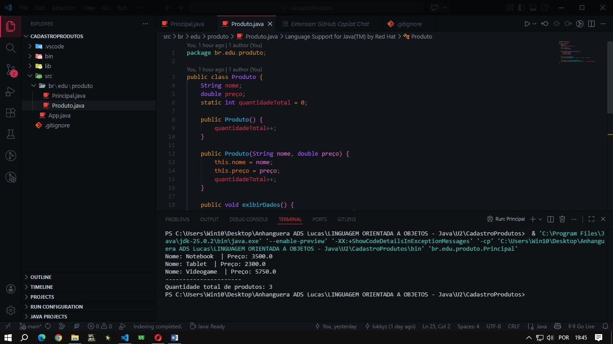

#  ATIVIDADE PRÁTICA ADS - Desenvolver um Programa em JAVA Que Simule o Cadastro de Produtos

## ORIENTAÇÃO DO PROJETO 📝

### *Atividade Proposta: Desenvolver um programa em Java que simule o cadastro de produtos.*

*O aluno deverá:*

***1- Criar a classe Produto com os seguintes atributos:*** 
- `String nome`;
- `double preco`;
- `static int quantidadeTotal` (atributo compartilhado).

***2-	Implementar:***
- *Um construtor padrão e um construtor com parâmetros (sobrecarga);*
- *Um método `exibirDados()` para mostrar nome e preço;*
- *Um método estático `exibirQuantidadeTotal()` para mostrar quantos produtos foram cadastrados.*

***3-	Na classe Principal:***
- *Criar ao menos três objetos `Produto`, usando os dois tipos de construtor;*
- *A cada novo produto, atualizar o atributo quantidadeTotal;*
- *Exibir os dados de cada produto;*
- *Exibir a quantidade total de produtos usando o método estático.*

---
## EXPLICAÇÃO DO PROJETO ✅

- ***O projeto consistiu na implementação de uma aplicação Java para gestão de inventário, focando na aplicação de conceitos fundamentais de Programação Orientada a Objetos e organização de projetos em ambiente de desenvolvimento.***

> *Técnicas e Métodos Utilizados*

- ***Encapsulamento e Organização de Pacotes***
  
*Foi estruturada uma hierarquia de pacotes seguindo o padrão `br.edu.produto`, garantindo a organização lógica das classes e facilitando a manutenção do código.*

- ***Sobrecarga de Construtores***

*Implementei a técnica de sobrecarga de métodos construtores na classe Produto. Isso permitiu a criação de objetos tanto de forma básica (construtor padrão) quanto com a passagem direta de atributos (nome e preço) no momento da instância, aumentando a flexibilidade da classe.*

- ***Membros Estáticos***

*Utilizei o modificador `static` para o atributo `quantidadeTotal` e para o método de exibição do total. Esta técnica permite que um valor seja compartilhado entre todas as instâncias da classe, funcionando como um contador global de objetos que persiste independentemente de qual instância o acesse.*

- ***Operadores de Incremento***

*Apliquei o operador de incremento unitário `(++)` dentro dos construtores para automatizar a contagem de produtos a cada nova instância criada no sistema.*

> ***Neste projeto, criei uma classe `Produto` dentro de um pacote específico. Usei construtores sobrecarregados para criar produtos de formas diferentes e um atributo estático para contar quantos produtos foram criados no total.***

---
## RESULTADO 💻

*Foram registrados 3 produtos diferentes, cada um com seu preço, na execução do código cada produto aparece organizado, e logo abaixo a quantidade de produtos que foram registrados no total.*

(Como é um sistema simples, não foi feita formatação para R$ ou outras moedas).

> ***Para melhor visualização dos códigos, segue abaixo:***

[Principal.java](https://github.com/lukkyzdev/CadastroProdutos/blob/main/CadastroProdutos/src/br/edu/produto/Principal.java)

[Produto.java](https://github.com/lukkyzdev/CadastroProdutos/blob/main/CadastroProdutos/src/br/edu/produto/Produto.java)
